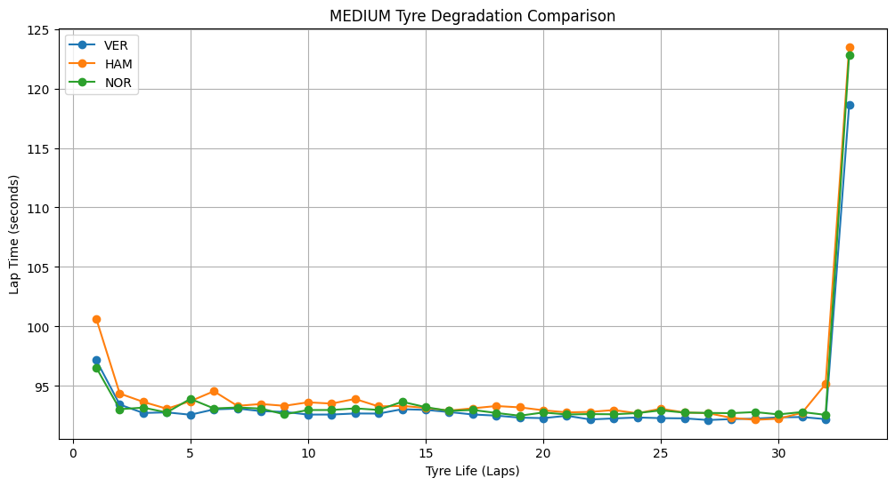
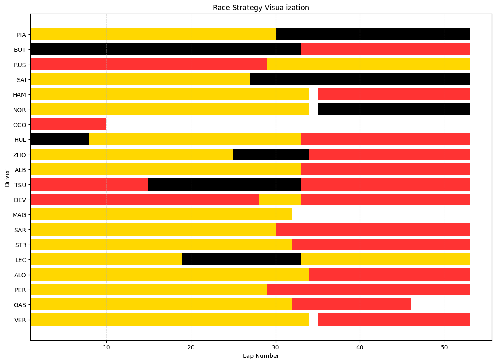

# 🏎️ TyreWearWiz

<div align="center">

**A Formula 1 Tyre Degradation & Race Strategy Visualization Project**

[](https://www.python.org/)
[](https://github.com/theOehrly/Fast-F1)
[]()
[]()
[]()

[Report Bug](https://github.com/NihaalNO/TyreWearWiz/issues) · [Request Feature](https://github.com/NihaalNO/TyreWearWiz/issues) · [Documentation](https://github.com/NihaalNO/TyreWearWiz/wiki)

</div>

---

## 📌 Table of Contents

1. [Project Overview](#project-overview)
2. [What You Will Learn](#what-you-will-learn)
3. [Key Analyses Covered](#key-analyses-covered)
4. [Screenshots](#screenshots)
5. [Project File Structure](#project-file-structure)
6. [Data Source](#data-source)
7. [Getting Started](#getting-started)
8. [Usage](#usage)
9. [References & Inspirations](#references--inspirations)
10. [License & Acknowledgements](#license--acknowledgements)

---

## Project Overview

**TyreWearWiz** is a focused Formula 1 data-visualization project that analyzes **tyre degradation, driver tyre management, and race strategy** using real race data.

Built entirely with **Python and Jupyter Notebook**, this project uses official F1 timing data via **FastF1** to transform raw telemetry into **clear, insightful visualizations**.

The project emphasizes:
- Why tyre degradation decides races  
- How drivers extend tyre life  
- How teams design race-winning strategies  

---

## What You Will Learn

By exploring this project, you will understand:

### 🛞 How Drivers Actually Manage Their Tyres
- Why drivers avoid pushing at maximum pace early in a stint  
- How smooth throttle and braking inputs reduce degradation  
- How lap time loss happens gradually, not suddenly  

### 🧠 How Teams Plan Race Strategies
- Why teams choose one-stop vs two-stop strategies  
- How tyre life defines pit windows  
- Why track position often outweighs raw pace  

### 🥇 Why P1 Often Never Loses the Lead
- How race leaders control pace to protect tyres  
- How clean air reduces sliding and overheating  
- How leaders force rivals into earlier pit stops  

> In Formula 1, the fastest driver does not always win —  
> the driver who **manages tyres best** usually does.

---

## Key Analyses Covered

### 1️⃣ Single Driver Tyre Degradation Analysis
- Lap Time vs Tyre Life curves  
- Compound-wise degradation trends  
- Degradation rate (seconds lost per lap)  

### 2️⃣ Comparing Drivers on Different Tyre Compounds
- Same compound, different drivers  
- Different compounds, same driver  
- Identifying superior tyre management  

### 3️⃣ Race Strategy Visualization
- F1-style horizontal stint charts  
- Pit stop timing analysis  
- Compound usage across the grid  

---

## Screenshots

> Example visual outputs generated by **TyreWearWiz**

### 📉 Single Driver Tyre Degradation


### 📊 Multi-Driver Tyre Comparison


### 🟦 Race Strategy Visualization


> 📌 *Screenshots are generated directly from the Jupyter notebooks.*

---

## Project File Structure

The repository is organized by **analysis type**, making it easy to navigate and extend:

```
TyreWearWiz/
│
├── Drivers/
│   └── Driver_name/
│       └── race_name-year.ipynb
│
├── Multi-drivers/
│   └── Race_track_name/
│       └── race_name-year.ipynb
│
├── Race-strategy/
│   └── Race_track_name/
│       └── race_name-year.ipynb
│
│
└── README.md
```
---
## Data & Formats

### Data Source
**TyreWearWiz** leverages the **[FastF1](https://github.com/theOehrly/Fast-F1)** Python package to access official Formula 1 timing and telemetry data. FastF1 provides:
- Real-time and historical session data
- Lap-by-lap telemetry (speed, throttle, brake, gear, DRS, etc.)
- Session information (weather, track status, race control messages)
- Driver and team metadata

### Telemetry Parameters
Each visualization incorporates multiple telemetry channels:

| Parameter | Description | Unit |
|-----------|-------------|------|
| **Speed** | Car velocity | km/h |
| **Throttle** | Accelerator pedal position | % (0-100) |
| **Brake** | Brake pressure/activation | Binary or % |
| **Gear** | Current gear selection | 1-8 |
| **RPM** | Engine revolutions per minute | rpm |
| **DRS** | Drag Reduction System status | Binary |
| **X, Y** | Track position coordinates | Meters |
| **Distance** | Distance along track | Meters |

---
## Getting Started

### Prerequisites
- **Python 3.8+** (3.10 or 3.12 recommended)
- **pip** package manager
- **Jupyter Notebook** or **JupyterLab**
- Stable internet connection (for initial FastF1 data downloads)

### Installation Steps

1. **Clone the Repository**
```bash
   git clone https://github.com/NihaalNO/TyreWearWiz.git
   cd TyreWearWiz
```

2. **Create Virtual Environment** (recommended)
```bash
   python -m venv venv
   
   # On Windows
   venv\Scripts\activate
   
   # On macOS/Linux
   source venv/bin/activate
```

3. **Install Dependencies**
```bash
   pip install -r requirements.txt
```

4. **Set Up FastF1 Cache** (optional but recommended)
```python
   # In your notebook or Python script
   import fastf1
   fastf1.Cache.Enabled()
```

### Required Packages
```
fastf1>=3.0.0
matplotlib>=3.5.0
numpy>=1.21.0
pandas>=1.3.0
jupyter>=1.0.0
```
---
## ▶️ Sample Usage

This project is designed to be **simple to run and easy to explore** using Jupyter Notebook.

### 1️⃣ Launch Jupyter Notebook
```bash
jupyter notebook
```
### 2️⃣ Open an Analysis Notebook
Choose the notebook based on the type of analysis you want:
+ Single Driver Tyre Degradation
```bash
Drivers/VER/british-2023.ipynb
```
+ Multi-Driver Tyre Comparison
```bash
Multi-drivers_silverstone/2023.ipynb
```
+ Race Strategy Visualization
```bash
Race-strategy_silverstone/2023.ipynb
```

### 3️⃣ Run the Notebook
Running the notebook will generate:
+ Tyre degradation curves
+ Driver comparison plots
+ F1-style race strategy visualizations

---
## Reference & Inspirations

### Primary Data Source
**[FastF1](https://github.com/theOehrly/Fast-F1)** - A comprehensive Python package for accessing Formula 1 timing and telemetry data. FastF1 provides the foundational data infrastructure that makes Ham-Hub possible.

- **Creator**: theOehrly
- **Documentation**: [docs.fastf1.dev](https://docs.fastf1.dev/)
- **GitHub**: [github.com/theOehrly/Fast-F1](https://github.com/theOehrly/Fast-F1)

### Developer Inspiration
**mar-antaya**: [[Github](https://github.com/mar-antaya)] - Acknowledged as a key inspiration for:
- Workflow design patterns
- Visualization approaches
- Data organization strategies
- Plotting techniques and aesthetics

### Additional Resources
- **F1 Official Timing**: Data sourced through FastF1's API integration
- **Matplotlib**: Advanced plotting and customization
- **Jupyter Notebooks**: Interactive analysis and documentation

---
## License & Acknowledgements

### License
This project is licensed under the **MIT License** - see the [LICENSE](LICENSE) file for details.

### Acknowledgements


- **FastF1 Development Team** ([theOehrly](https://github.com/theOehrly)): For creating and maintaining the incredible FastF1 package
- **mar-antaya** ([mar-antaya](https://github.com/mar-antaya)): For workflow inspiration and visualization techniques
- **Formula 1**: For the exciting sport that generates this fascinating data
- **F1 Data Community**: Researchers, analysts, and enthusiasts who push the boundaries of motorsport analytics

### Data Attribution
All Formula 1 timing and telemetry data is accessed via the **FastF1** package, which sources official F1 timing data. This project is not affiliated with, endorsed by, or connected to Formula One Management, Formula One World Championship Limited, or any F1 teams.

### Fair Use Statement
This project is created for **educational and research purposes**, focusing on data visualization and machine learning applications. All visualizations are transformative works based on publicly available telemetry data.

---
